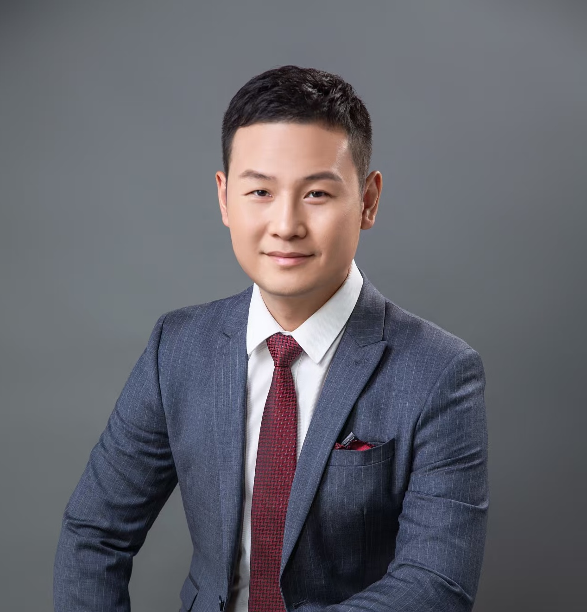
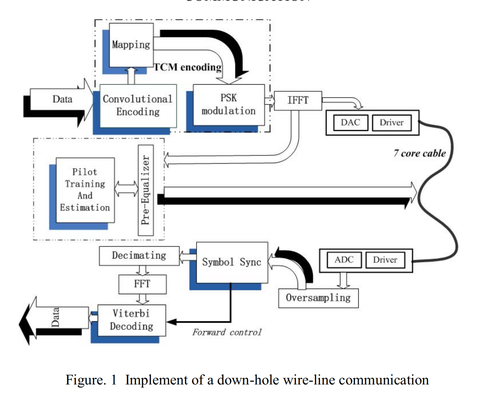

# 王政

我目前是清华大学自动化系硕士研究生，导师为[黄高教授](https://www.gaohuang.net/)。我的研究兴趣包括大语言模型、深度学习和计算机视觉，特别是在大语言模型和视觉-语言模型方面。

我于2026年获得中国石油大学(北京)信息与通信工程硕士学位。先后在[新华三集团](https://www.h3c.com/cn/)负责核心路由器 Vxlan 协议研发 、[爱奇艺](https://www.iqiyi.com/)负责爱奇虚拟机云平台、[小红书](https://www.xiaohongshu.com/)负责算法工程团队。

[Email](mailto:z-wang22@mails.tsinghua.edu.cn) / [Github](https://github.com/geogre) / [Linkedin](https://www.linkedin.com/in/zheng-wang-tsinghua/)

## 最新动态

- [03/2025] 构建开源 Agent 协作平台 Cooragent。
- [04/2023] 获得清华大学国强杯创业大赛冠军，清华大学三创大赛全球三强。
- [07/2022] 攻读清华大学自动化系 MEM 工程管理硕士学位。
- [03/2021] 加入小红书，负责算法工程团队，构建高效推理平台。
- [12/2017] 开始负责爱奇艺虚拟机云团队，成功构建新一代虚拟机云平台，带领团队获得部门优秀奖。
- [07/2016] 开始在新华三集团负责核心路由器 Vxlan 协议研发。

## 发表论文

\* 表示共同第一作者

<strongA Frequency Domain Scheme for High Speed Telemetry down Hole Wire Line Communication</strong> 
<strong>Zheng Wang</strong>Dejun Liu; Qinghui Ai; Xing Cheng; Dahuan Xue; Aidong Yang 
<em>IEEE/IMCCC 2015</em>, 2023 
[<a href="#">论文</a>] [<a href="data/wang2023neurips.bib">引用</a>] [<a href="https://github.com/geogre/efficient-vlm">代码</a>]

模板来源 [Jon Barron](https://jonbarron.info/)